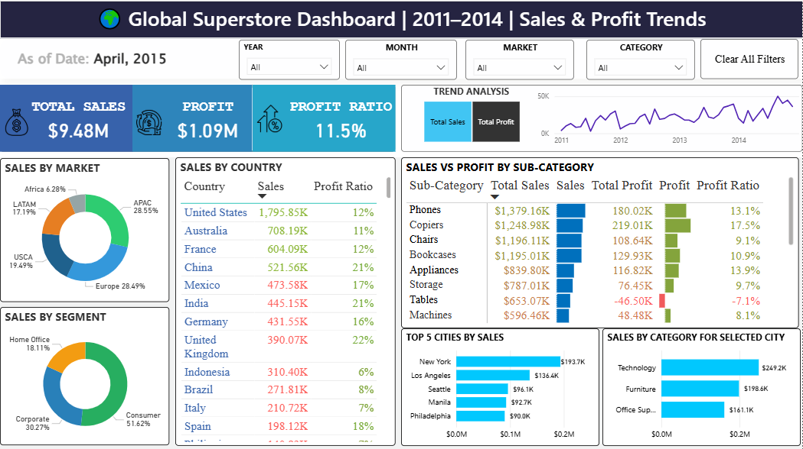

# 🌍 Global Superstore Dashboard (2011–2014)

**Power BI** dashboard analyzing **Sales & Profit Trends** by Market, Segment, Country, and Product Sub-Category.  
Designed for executive review and category management.

## 🔎 Overview
This interactive report answers:
- Which **markets/segments** drive sales and profit?
- Which **countries** show strong **profit ratios** despite smaller sales?
- Which **sub-categories** are **loss-making** (e.g., Tables) and require action?
- How do trends evolve **year/month** with quick filters?

**Tech:** Power BI Desktop · DAX · Data Modeling · Visual Design

## 📈 Key Insights
- **APAC & Europe** lead by sales (~28% each). **USCA** remains strong at ~19.5%.
- **Consumer** segment contributes **>50%** of revenue.
- **United States** tops sales ($1.79M), while **China (21%)** and **UK (22%)** deliver strong **profit ratios**.
- **Tables** sub-category is **unprofitable (–$46.5K)** → review price, discount, and shipping.
- **Top cities** (NYC, LA, Seattle, Manila, Philadelphia) drive concentrated revenue.

## 🧭 Report Structure
- **KPI Strip:** Total Sales, Profit, Profit Ratio
- **Trend Analysis:** Sales vs Profit toggle with Year/Month slicers
- **Market & Segment Donuts:** Clean, color-coded share comparison
- **Sales by Country:** Sales + Profit Ratio with conditional formatting
- **Sales vs Profit by Sub-Category:** Bar + variance bars + profit ratio
- **Top 5 Cities:** Sales contribution
- **Category by Selected City:** Category breakdown after city selection

## 🗂 Files
- `pbix/Global-Superstore-Dashboard.pbix` – Power BI report (tracked with Git LFS)
- `assets/img/` – Screenshots for quick preview
- `docs/CaseStudy.md` – Extended write-up
- `data/` – sample

## ▶️ How to Open
1. Download `pbix/Global-Superstore-Dashboard.pbix`
2. Open in **Power BI Desktop**

## 🧱 Data & Modeling
- Dataset: **Global Superstore (2011–2014)** (public educational dataset)
- Modeling: Cleaned categories, created date table, standardized region mapping
- DAX:
  - `Profit Ratio = DIVIDE([Total Profit], [Total Sales])`
  - `Total Sales = SUM(Sales[Sales])`
  - `Total Profit = SUM(Sales[Profit])`

## 📜 License
This repository is released under the [MIT License](LICENSE).

---

*Built by Sai Krishna Tiruveedhula — Data Analyst | Power BI & Analytics.*

